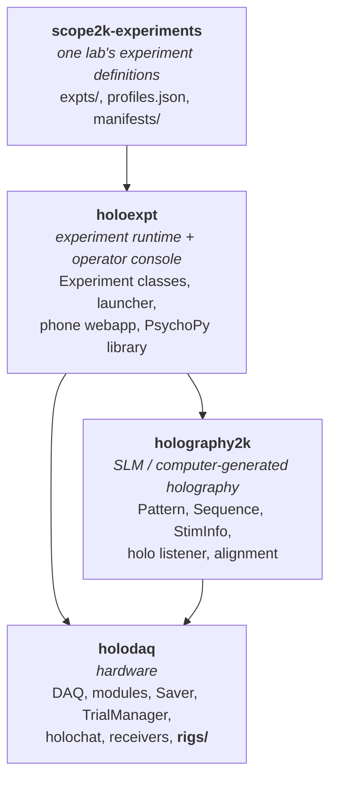
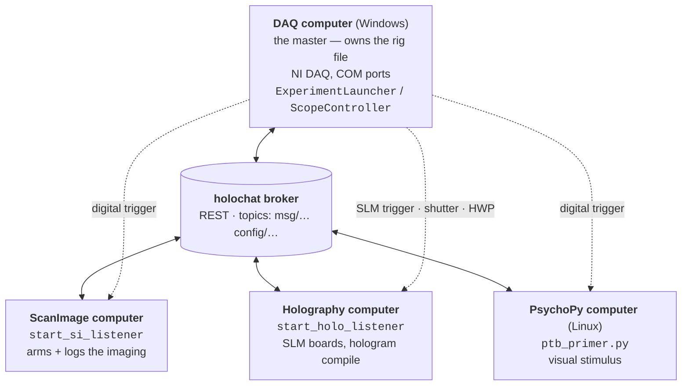
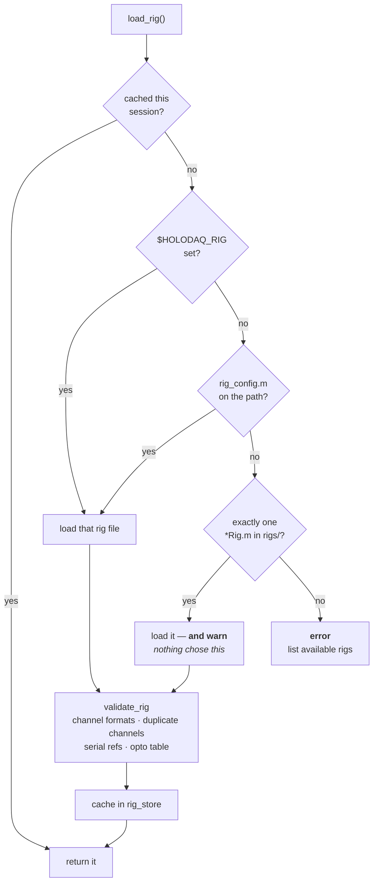
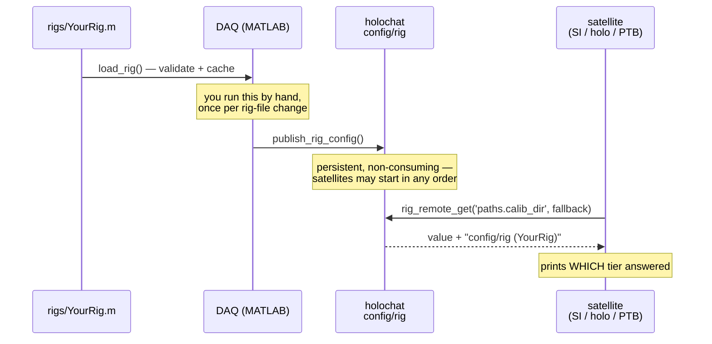
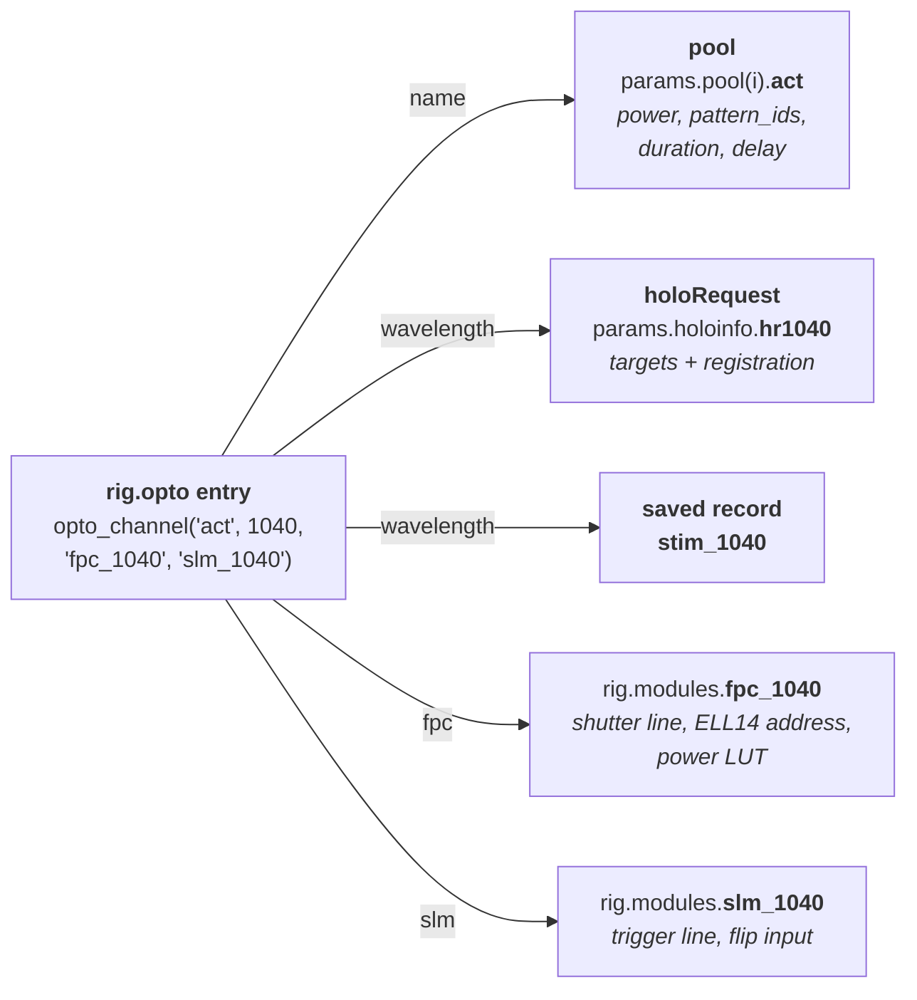
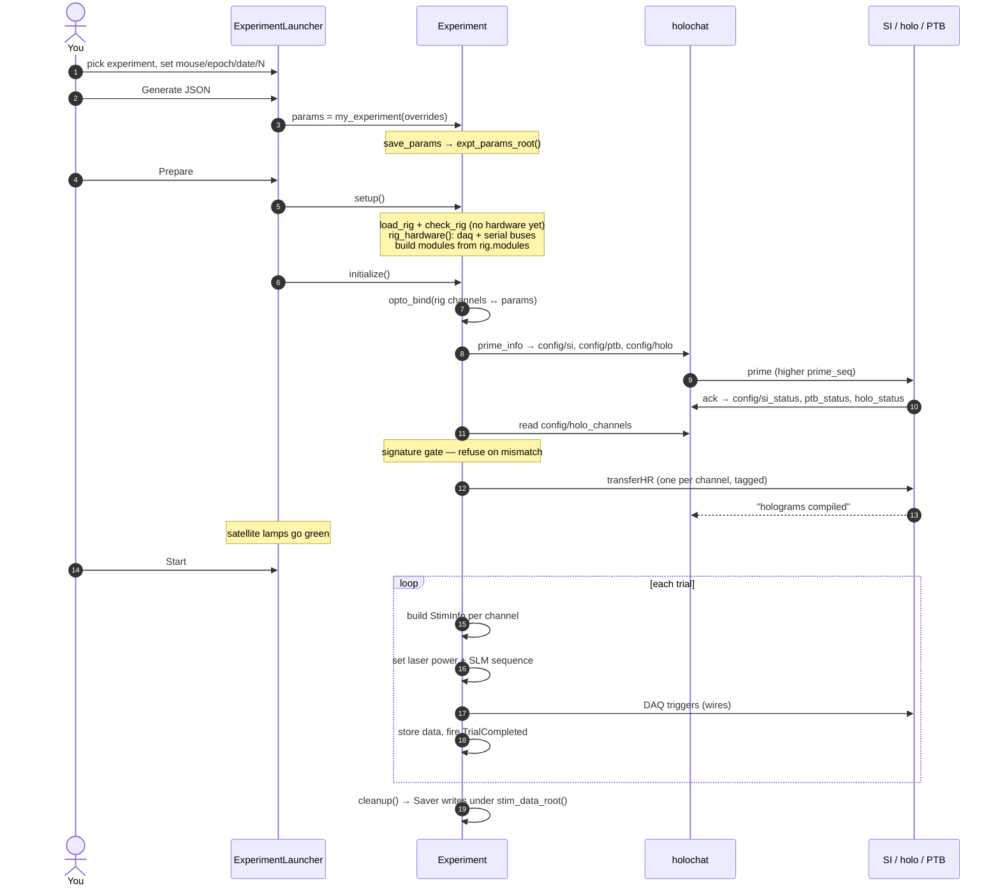

# holodaq

MATLAB data acquisition and stimulation framework for two-photon holographic
stimulation rigs — and the place where **your microscope's wiring is described**.

This README is the entry point for the whole four-repo system. If you are
bringing the code up on a *new* microscope, read it start to finish: it covers
both the background (how the pieces decide what your scope is) and the
procedure (what to write, in what order, and how to check it before you point a
laser at anything).

---

## Table of contents

**Background — how the system thinks**

1. [The four repos](#1-the-four-repos)
2. [The four computers](#2-the-four-computers)
3. [The rig file: one source of truth](#3-the-rig-file-one-source-of-truth)
4. [How the satellites learn the config](#4-how-the-satellites-learn-the-config)
5. [Opto channels: name vs. wavelength](#5-opto-channels-name-vs-wavelength)
6. [The life of one experiment](#6-the-life-of-one-experiment)
7. [Where the system refuses to run](#7-where-the-system-refuses-to-run)

**Procedure — bringing up your scope**

8. [Porting checklist](#8-porting-checklist)
9. [Step 1 — lay out the checkouts](#step-1--lay-out-the-checkouts)
10. [Step 2 — stand up a holochat broker](#step-2--stand-up-a-holochat-broker)
11. [Step 3 — write your rig file](#step-3--write-your-rig-file)
12. [Step 4 — select the rig on each machine](#step-4--select-the-rig-on-each-machine)
13. [Step 5 — validate off-rig](#step-5--validate-off-rig)
14. [Step 6 — publish, and start the satellites](#step-6--publish-and-start-the-satellites)
15. [Step 7 — calibrate](#step-7--calibrate)
16. [Step 8 — experiments](#step-8--experiments)
17. [Step 9 — run](#step-9--run)

**Reference**

18. [Rig file schema](#18-rig-file-schema)
19. [Per-machine configuration summary](#19-per-machine-configuration-summary)
20. [Function reference](#20-function-reference)
21. [Troubleshooting](#21-troubleshooting)
22. [Known limits](#22-known-limits)

---

# Background — how the system thinks

## 1. The four repos

The system is split so that **the parts that describe hardware are separate from
the parts that describe science**. Only the lower three are meant to move to a
new scope unchanged.



Dependencies point **downward only**: holodaq never imports holoexpt; holoexpt
never imports your experiments repo.

| repo | answers | portable? |
|---|---|---|
| `holodaq` | *What is this microscope wired to?* | yes — you add one rig file |
| `holoexpt` | *How do I run an experiment on it?* | yes — unchanged |
| `holography2k` | *How do I make and play a hologram?* | yes — the `2k` name is historical |
| `scope2k-experiments` | *What experiments does this lab run?* | it's an example; you make your own |

You will write **one new file** (`holodaq/rigs/<YourName>Rig.m`), **a few
one-line per-machine config files**, and **your own experiments repo**. Nothing
else should need editing.

## 2. The four computers

A full rig is four machines on one LAN, coordinated by a small REST broker
called **holochat**. MATLAB is single-threaded and cannot be a server, so every
machine *polls* the broker; nobody listens.



Two channels run in parallel and do different jobs:

* **Wires** carry *timing*. The DAQ pulses a digital line and the satellite acts
  within microseconds. Every wire is a `rig.modules.<name>` entry.
* **holochat** carries *intent*: "the next experiment is `KKS081-1` epoch 3,
  these are the wavelengths, this is the stim script". Slow, reliable,
  re-readable.

A rig can be smaller. A scope with no SLM, no PsychoPy box, or no photostim
laser at all is a legitimate configuration — you omit those modules and the code
paths that need them are skipped (§3).

**`ExperimentLauncher` and `ScopeController` must never run at the same time**:
only one MATLAB object can own the DAQ and the COM ports.

## 3. The rig file: one source of truth

Everything machine-specific — DAQ channel map, device IDs, sample rate, COM
ports, data drives, calibration folders, network endpoints — lives in exactly
one file:

```
holodaq/rigs/<YourName>Rig.m
```

It is a plain MATLAB function returning a struct. Nothing else in any of the
four repos hardcodes your wiring; every class and script reads the loaded rig.



Three properties matter:

**Optional hardware is declared by presence.** There is no `has_slm = false`
flag anywhere. A module your rig lacks is simply *absent* from `rig.modules`,
and every consumer asks `rig_has(rig, 'patch')` before constructing it. Deleting
a line from your rig file is how you say you have no patch rig.

**Validation happens before hardware opens.** `load_rig` checks channel string
formats (`port0/line5`, `ai0`, `ao1`, `ctr0`), refuses to let two modules claim
the same physical channel, checks that every `modules.<m>.serial` names a real
`rig.serial` entry, and validates the whole opto table. A malformed rig file
fails *without having opened COM3/COM4* — which matters, because a half-opened
serial port stays held and forces a MATLAB restart.

**Reads are fallback-tolerant.** Class internals use
`rig_get('network.holochat_server', <default>)`, which returns the default when
no rig is loaded. That is what lets satellite machines and Simulate-mode GUIs —
which never call `load_rig` — keep working.

> **The lone-rig-file fallback warns for a reason.** If `rigs/` holds exactly one
> rig file and nothing on the machine selected it, `load_rig` uses it and warns.
> Take that seriously: another microscope's rig file has the wrong channel map
> for your hardware, and on a two-photon rig that means commanding the wrong
> physical line. Always do
> [Step 4](#step-4--select-the-rig-on-each-machine).

## 4. How the satellites learn the config

The DAQ has the rig file. The other three machines do not — the PsychoPy box
runs Python and cannot call `load_rig` at all. So the DAQ **publishes** the
satellite-relevant parts of its rig to a persistent holochat topic, and the
satellites read it back.



`rig_remote_get` resolves in three tiers and **always says which one answered**:

1. the published `config/rig` payload (the DAQ is authoritative),
2. a local rig file, if that machine happens to have one,
3. the coded default.

A cold broker is not an error — the satellite comes up on its defaults and warns
you, naming `publish_rig_config`. A listener that refuses to boot is worse than
one running on last week's paths, but you should know which you have.

Three rules keep publishing from doing harm:

* **Empty values are never published.** An empty shipped as authoritative would
  override a satellite's own correct literal.
* **Machine-scoped leaves are never published** — `paths.matlab_paths` (the
  DAQ's own `addpath` list) and `network.remote_api` (a `127.0.0.1` URL) are
  correct only where they were written.
* **Only `char`/numeric/logical leaves go on the wire.** Anything else is
  skipped and reported rather than silently mangled by the JSON transport.
  (The payload is deliberately *flat* — `paths.calib_dir` becomes
  `paths_calib_dir` — because the Python reader unwraps exactly one level.)

`rig.modules` is **never** published: it is DAQ-side wiring no satellite should
act on.

**The one value that cannot come from the config is the broker URL itself** —
you need it in order to read the config. So `$HOLOCHAT_SERVER` is authoritative
for that one setting on all four machines, MATLAB and Python alike, and
`holochat_server()` announces its source once per session.

## 5. Opto channels: name vs. wavelength

This is the heart of the portability work, and worth understanding before you
write your rig file.

A photostim path is a laser + a power attenuator + an SLM. The old code
hardcoded exactly two of them, called `red` (1100 nm) and `blue` (900 nm), in
four copy-pasted blocks. Any other scope was unrepresentable.

Now each path is declared once:

```matlab
rig.opto = opto_channel('act', 1040, 'fpc_1040', 'slm_1040');
```

and **the two identifiers do different jobs**:

| identifier | is | derives | why it is separate |
|---|---|---|---|
| `name` (`'act'`) | *code identity* — what the experiment author wrote | `params.pool(i).act` | disambiguates two arms sharing one wavelength |
| `wavelength` (`1040`) | *physical identity* | `holoinfo.hr1040`, saved `stim_1040` | binds power commands to the right calibration |

Neither is ever typed twice. That is the safety property: a channel cannot be
wired to one wavelength's hardware and another wavelength's calibration, because
the field names on both sides come from the same rig-file row.



**Declaration order is wire order.** The order of entries in `rig.opto` is the
order holoRequests are transferred to the holography computer and the cell
position of each firing order. It is a contract between two machines.

Because it is a contract, both machines compute a **signature** from their own
view of it — `act@1040#auto`, or `red@1100#auto|blue@900#auto` — and compare
before anything is compiled or armed. A mismatch in count, order, name or
wavelength is a *refusal*, not a warning: the failure it prevents is a beam
steered by the wrong phase mask.

`opto_channels` enforces the rest at `load_rig` time: every referenced module
must exist; names must be unique; no two channels may share an `fpc`, an `slm`,
or a half-wave-plate address; and two channels at the same wavelength must pin
distinct `slm_board`s (the holography computer resolves boards from wavelength,
so it could not otherwise tell them apart).

A rig with **no** `rig.opto` is legal — that is a vis-only scope, and
`opto_channels` returns an empty table rather than erroring.

## 6. The life of one experiment



The three flavours are chosen automatically by `make_experiment` from the
*shape* of the trial pool:

| pool contains | class |
|---|---|
| `vis` only | `VisExperiment` |
| photostim only | `HoloExperiment` |
| both | `FullExperiment` |

A photostim command is recognised structurally — a struct with `pattern_ids`,
`power_per_cell`, `duration`, `delay` — under *any* field name. That is exactly
why a scope with one 1040 nm arm writing `pool.act` works without touching the
runtime.

**Where things get saved:**

| what | resolved by | default |
|---|---|---|
| trial data `.mat` | `stim_data_root()` → active profile's save root, else `rig.paths.data_root` | `K://KKS//stim-data` (warns) |
| `hologram_info.mat` | `holoinfo_file()` → `<data root>/<date>/<date>_<mouse>_hologram_info.mat` | — |
| experiment parameter `.json` | `expt_params_root()` → `rig.paths.expt_params` | `K:/KKS/expt-params` (warns) |
| ScanImage tiffs | `rig.paths.si_root`, on the SI machine | `D:` |

Both defaults warn when used, because nothing on the machine said where its data
belongs.

## 7. Where the system refuses to run

The portability work added a set of deliberate hard stops. Knowing what each
protects makes their error messages readable.

| refusal | raised by | prevents |
|---|---|---|
| duplicate DAQ channel | `load_rig` | two modules commanding one physical line |
| unknown `serial` reference | `load_rig` | a module bound to a bus that does not exist |
| shared `fpc`/`slm`/rotator between channels | `opto_channels` | setting one channel's power moving another's attenuator |
| two channels, one wavelength, no pinned board | `opto_channels` | one SLM driven with two hologram stacks |
| missing required module (`si`, …) | `Experiment.check_rig` | a session that runs perfectly and records nothing |
| rig channel with no pool command | `opto_bind` | an armed, gated laser holding a stale rotator angle |
| pool command no rig channel claims | `opto_bind` | a red+blue experiment silently dropping half its stimulus on a one-laser rig |
| opto signature mismatch | `Experiment.confirm_opto_agreement` | holograms compiled against the wrong wavelength's SLM calibration |
| two wavelengths → one SLM board | `start_holo_listener` | two hologram stacks overwriting each other |

Two things **warn** rather than refuse, and you should know why:

* **A missing power LUT.** `LaserPowerControl` tolerates an empty calibration,
  so refusing would newly stop sessions that run today. But with no LUT *both
  power clamps silently vanish and the half-wave plate is never rotated, while
  the shutter still opens* — the delivered power is unknown. Do not trust a run
  that printed this warning.
* **A rig file shadowed on the MATLAB path.** `addpath` prepends, and
  `rig.paths.matlab_paths` may `genpath` a whole code tree, so a stale second
  checkout can win. `load_rig` prints which file actually ran; if it is not the
  one you are editing, your edits are doing nothing.

---

# Procedure — bringing up your scope

## 8. Porting checklist

```
[ ] 1. Clone the four repos side by side on each machine that needs them
[ ] 2. Stand up a holochat broker; export $HOLOCHAT_SERVER everywhere
[ ] 3. Write holodaq/rigs/<YourName>Rig.m from rigs/ExampleRig.m
[ ] 4. Select the rig + point at the checkouts, per machine (rig_config.m etc.)
[ ] 5. Validate off-rig:  matlab -batch "addpath(genpath(pwd)); test_rig_smoke"
[ ] 6. publish_rig_config() on the DAQ; start the three satellite listeners
[ ] 7. Calibrate: power->angle LUTs, then SLM/CoC alignment
[ ] 8. Create your experiments repo (expts/, profiles.json, manifests/)
[ ] 9. ExperimentLauncher -> Prepare -> Start
```

Steps 1–5 need **no hardware** and can be done off-rig. Do them first.

## Step 1 — lay out the checkouts

The resolvers (`holodaq_root`, `expts_root`, `holo_paths`) all fall back to
sibling checkouts, so this layout needs no configuration at all:

```
<somewhere>/
├── holodaq/            hardware + rigs/          ← DAQ, SI, holo machines
├── holoexpt/           runtime + launcher + PTB  ← DAQ, PTB machine
├── holography2k/       SLM + alignment           ← DAQ, holo machine
└── my-lab-experiments/ your experiment defs      ← DAQ machine
```

Each resolver refuses to guess between two equally plausible candidates and
errors with instructions instead — a stale `holodaq` means a stale channel map,
which is the wrong physical wiring.

Which machine needs what:

| machine | needs | runs |
|---|---|---|
| DAQ | all four | `ExperimentLauncher` or `ScopeController` |
| ScanImage | `holodaq` | `start_si_listener` |
| Holography | `holodaq`, `holography2k` | `start_holo_listener` |
| PsychoPy | `holoexpt` (+ your experiments, for stim scripts) | `ptb_primer.py` |

## Step 2 — stand up a holochat broker

> **This is the one prerequisite not contained in these four repos.** holochat is
> a small REST service; the client is here (`interfaces/holochat/`), the server
> is not. You need one reachable by all four machines.

The client speaks a tiny API — `<server>/<path>/<topic>` for
`path ∈ {msg, config, db}`:

| verb | path | meaning |
|---|---|---|
| `POST` | `/msg/<topic>` | queue a **consume-once** message |
| `GET` | `/msg/<topic>` | read it (marks it read; 404 when empty) |
| `DELETE` | `/msg/<topic>` | flush the queue |
| `POST` | `/config/<topic>` | set a **persistent, re-readable** value (overwrites) |
| `GET` | `/config/<topic>` | read it (404 when unset) |
| `DELETE` | `/db/<topic>` | reset a sender's entry |

Bodies are `{"sender": "<id>", "message": <mps.json 'large'-encoded payload>}`.

The distinction that matters: `config` topics are **persistent and
non-consuming**, which is why satellites may start in any order and still see
the latest prime — and why `prime_seq` exists, to tell a *new* prime from a
re-read of the same one.

Then, on **every** machine:

```bash
export HOLOCHAT_SERVER=http://<broker-host>:8000     # Linux / macOS
setx HOLOCHAT_SERVER "http://<broker-host>:8000"     # Windows, persistent
```

One export covers MATLAB and Python on that box. A stale value silently splits
the rig across two brokers — nothing arrives, nothing errors — so
`holochat_server()` prints the URL and its source once per MATLAB session. Check
that line.

## Step 3 — write your rig file

```bash
cp holodaq/rigs/ExampleRig.m holodaq/rigs/MyScopeRig.m
```

Rename the function to match the filename, then fill it in. Every field is
documented inline in the template; `rigs/Scope2KRig.m` is a complete working
example. The full schema is in [§18](#18-rig-file-schema).

**Delete what you do not have.** That is the mechanism, not a shortcut:

```matlab
% No patch rig? Delete the line. No SLM? Delete slm_* and rig.opto.
% No PsychoPy box? Delete rig.modules.ptb and rig.ptb.
rig.modules.patch = struct('output', 'ao0', 'input', 'ai7');   % <- delete
```

### Declaring your opto channels

The common case is one channel, and needs no ceremony:

```matlab
rig.modules.fpc_1040 = struct('shutter', 'port0/line6', 'serial', 'ell14', ...
    'ell14_channel', 1, 'calibration', '', 'khz', 250);
rig.modules.slm_1040 = struct('trigger', 'port0/line8', 'flip', 'ai3');

rig.opto = opto_channel('act', 1040, 'fpc_1040', 'slm_1040');
```

Two channels — remember the order is the wire order:

```matlab
rig.opto = [ opto_channel('red',  1100, 'fpc_1100', 'slm_1100'), ...
             opto_channel('blue',  900, 'fpc_900',  'slm_900') ];
```

One laser split across two SLMs at the same wavelength — each arm **must** pin
its own board, since it cannot be derived:

```matlab
rig.opto = [ opto_channel('arm1', 1040, 'fpc_a', 'slm_a', 'slm_board', 1), ...
             opto_channel('arm2', 1040, 'fpc_b', 'slm_b', 'slm_board', 2) ];
```

No photostim at all: omit `rig.opto` entirely, and vis-only experiments run
normally.

Naming notes:

* A channel `name` must be a valid MATLAB identifier (it becomes a struct
  field), and `vis`, `opto` and `type` are reserved.
* Names are free — `'act'`, `'sup'`, `'aux'` are as valid as `'red'`. The colour
  names on Scope2K are historical, kept so ~36 existing experiment files run
  unedited.
* `slm_board` / `slm_lut` are optional; leaving them unset means "let the
  holography computer derive them from the wavelength". A relative `slm_lut`
  resolves against `rig.paths.slm_lut_dir`.

> **Watch the option names.** The parameters are **`'slm_board'`** and
> **`'slm_lut'`**. The doc comment at the top of `opto_channel.m` (and one error
> message in `opto_channels.m`) still says `'Board'` / `'Lut'`, which will *not*
> match — `inputParser` partial matching works on prefixes. Use the long names,
> as `ExampleRig.m` and `Scope2KRig.m` do.

### Two field-placement traps

Both are flagged in the template, because both produce confusing failures:

* **PsychoPy settings live in `rig.ptb`, not `rig.modules.ptb`.** `rig_hardware`
  opens every `rig.serial` entry a *module* references — so putting the PTB
  box's `/dev/ttyUSB0` under a module would make the Windows DAQ try to open it.
  `rig.modules.ptb.trigger` (the DAQ's own digital out) stays where it is.
* **A `rig.serial` entry is inert until something references it.** Only the
  conventional `ell14` / `wheel` plus buses named by a module's `serial` field
  get opened. That is why a port number may legitimately repeat across entries
  that live on *different machines* — Scope2K's `wheel` COM3 on the DAQ vs.
  `sutter` COM3 on the holography box.

## Step 4 — select the rig on each machine

Nothing picks a rig for you. On each machine that loads one:

```matlab
% copy rigs/rig_config.m.example -> rig_config.m anywhere on your MATLAB path
function name = rig_config()
    name = 'MyScope';        % -> rigs/MyScopeRig.m
end
```

`rig_config.m` is gitignored: one per machine, never committed. Setting
`$HOLODAQ_RIG` works too, and wins over the file.

The other per-machine pointers follow the same pattern — **explicit argument →
environment variable → gitignored config file → lone sibling checkout**:

| what | env var | config file | lives in |
|---|---|---|---|
| which rig | `HOLODAQ_RIG` | `rig_config.m` | holodaq |
| where holodaq is | `HOLODAQ_HOME` | `holodaq_config.m` | holoexpt |
| where experiments are | `HOLOEXPT_EXPTS` | `expts_config.m` | holoexpt |
| broker URL | `HOLOCHAT_SERVER` | *(env only — it is the bootstrap)* | all |

With the sibling layout from Step 1, only `rig_config.m` and `HOLOCHAT_SERVER`
are strictly required.

## Step 5 — validate off-rig

No hardware needed:

```bash
cd holodaq
matlab -batch "addpath(genpath(pwd)); test_rig_smoke"
```

This exercises the whole configuration layer: rig resolution and validation,
fallback behaviour with no rig loaded, the opto table's single- and
cross-channel rules, signature generation, and save-root resolution. It errors
on the first failure and prints `PASS` otherwise.

To check *your* rig file specifically:

```matlab
addpath(genpath(pwd));
rig = load_rig('MyScope')          % validates; prints which file actually ran
opto_channels(rig)                 % the resolved channel table
opto_signature(opto_channels(rig)) % what the holo computer must agree with
publish_rig_config('DryRun', true) % exactly what would go on the wire
```

`publish_rig_config('DryRun', true)` is the useful one before you go near
hardware: it prints every key it *would* publish, plus everything it skipped and
why (empty, machine-scoped, or unsupported on the wire).

## Step 6 — publish, and start the satellites

On the **DAQ**, once per rig-file change:

```matlab
publish_rig_config()
```

Then bring up the satellites, in any order — the config topic is persistent.

**ScanImage computer** (ScanImage already running, `hSI`/`hSICtl` in the base
workspace):

```matlab
start_si_listener            % tiff root from rig.paths.si_root
start_si_listener('E:')      % explicit override always wins
```

**Holography computer:**

```matlab
start_holo_listener                              % channels from the rig's opto table
start_holo_listener('Wavelengths', [1040])       % open a deliberate subset
start_holo_listener('CalibDir', 'D:\calibs')     % explicit overrides win
```

It prints its whole resolved config with the source of each value, then its SLM
inventory. **Read those lines** — that is how you catch a satellite still
running on coded defaults because the broker was cold. Changing the wavelength
set requires a restart: the SLM boards are opened once at startup, because a
Meadowlark board cannot safely be reopened per experiment.

**PsychoPy computer:**

```bash
python ptb_primer.py                                    # broker from $HOLOCHAT_SERVER
python ptb_primer.py --url http://host:8000 --expts /path/to/experiments
```

Each listener re-primes automatically on every **Prepare** — leave them running
all session. Ctrl-C stops them.

After a rig-file change you must re-run `publish_rig_config()` **and** either
call `rig_remote_get('refresh')` on the satellite or restart it: the payload is
fetched once per session and cached.

## Step 7 — calibrate

Two independent calibrations, both writing into folders your rig file names.

**Power → angle LUTs** (per laser):

```matlab
AutoLaserPowerCalib_HWP     % half-wave-plate rotator path
AutoLaserPowerCalib_EOM     % EOM path
AutoLaserPowerCalib_MOD     % modulator path
```

These write into `rig.paths.power_calib_dir`. Point each channel's
`rig.modules.fpc_<tag>.calibration` at the resulting `.mat`. Until you do, that
channel runs unclamped — see the warning in
[§7](#7-where-the-system-refuses-to-run).

**SLM ↔ camera alignment**, on the holography machine:

```matlab
align_slm_to_camera_scope2k       % holography2k/alignment/alignSLMtoCam/
```

Writes dated `*_Calib_<wavelength>*.mat` into `rig.paths.calib_dir`, which the
holo listener then finds automatically via `find_latest_calib` (newest by file
date, per wavelength). This is why `calib_dir` must be **one folder for both
reading and writing** — split them and a fresh calibration lands where nothing
loads it from.

The live alignment flow also stages holeburn `.tif`s in `rig.paths.holo_scratch`
and needs `rig.serial.sutter` for the manipulator.

`manual_power_control_setup` and `manual_slm` (in `holography2k/manual-use/`)
give hand control of the attenuators and SLM for bench work; both read the rig
rather than hardcoded paths.

## Step 8 — experiments

Your experiments live in their own repo, shaped like this:

```
my-lab-experiments/
├── expts/<profile>/<experiment>/    definitions, grouped by profile
├── expts/<profile>/.archive/        not indexed (anything dot-prefixed is invisible)
├── profiles.json                    name, expts_subdir, save_root
└── manifests/<profile>.json         display names, visibility, stim scripts
```

Profiles are per-person workspaces; the launcher's Profile dropdown switches
which subtree it discovers, which manifest it uses, and where data is saved. One
profile may set `"remote_default": true` to be the one a phone session opens on.

An experiment is a function returning a params struct. **The filename must match
the declared function name** — the launcher invokes it via `str2func`, and
discovery only qualifies files whose first line of code matches
`function params = <name>(...)`, so helpers in the same folder are ignored.

```matlab
function params = my_experiment(ov)
    base.n_trials = 200;
    base.trial_duration = 3;
    info.mouse = 'TEST'; info.epoch = 1; info.experiment = 'demo';

    % GUI override hook — a no-op when called directly
    if nargin < 1, ov = struct(); end
    [base, info] = apply_overrides(base, info, ov);

    % Build the trial pool. Each entry carries .vis and/or per-channel commands
    % named for YOUR rig's opto channels.
    for i = 1:n
        pool(i).vis = struct('orientation', ..., 'contrast', ...);
        pool(i).act = struct('pattern_ids', [...], 'power_per_cell', ..., ...
                             'duration', 0.2, 'delay', 1.0);
    end

    params = struct('info', info, 'base', base, 'pool', pool);
    save_params(params);
end
```

The pool field names **must match your rig's opto channel names** — `opto_bind`
enforces set equality in both directions, so a channel with no command and a
command with no channel are both hard errors. To hold a channel dark for a
trial, give it `power_per_cell = 0`; that closes its shutter.

The easiest start is to copy an experiment out of `scope2k-experiments` and
rename its pool fields to your channels. `expts/Kevin/generic-screener/` is a
good vis-only template — it is designed as the first run of every set, and
doubles as a rig sanity check.

## Step 9 — run

```matlab
ExperimentLauncher                       % local
ExperimentLauncher('Token', '8261')      % also serve the phone webapp
```

Then: pick an experiment → set mouse / epoch / date / N trials → **Generate
JSON** → **Prepare** → **Start**. The satellite readiness line shows
`SI / PsychoPy / Holo` going green as each acks the prime. **Stop** requests a
clean abort at the next trial boundary; partial data is still saved.

For laser and power control **without** an experiment:

```matlab
ScopeController                          % laser / shutter / power GUI only
ScopeController('Token', '8261')         % + phone webapp
```

Optional extras:

* **Phone control** — `holoexpt/remote-webapp/`. Copy
  `server/config.example.json` → `config.json`, set a real PIN, run the server
  on the rig PC, and pass the same PIN as `'Token'`. See that folder's README.
* **Notifications** — Slack or Discord webhooks on run start / progress /
  finish:

  ```matlab
  configure_notifications('enabled', true, 'platform', 'slack', ...
                          'webhook_url', 'https://hooks.slack.com/...')
  ```

  Stored in MATLAB preferences, so the webhook URL never touches the repo.

---

# Reference

## 18. Rig file schema

Everything except `rig.name` is optional; omit what you do not have.

### Top level

| field | type | meaning |
|---|---|---|
| `rig.name` | char | **required** — short name for this rig |

### `rig.paths`

| field | default | meaning |
|---|---|---|
| `matlab_paths` | `{}` | folders `default_setup` adds. **Machine-scoped** — never published |
| `data_root` | `K://KKS//stim-data` (warns) | where `Saver` writes trial data |
| `expt_params` | `K:/KKS/expt-params` (warns) | per-run parameter `.json` |
| `si_root` | `D:` | ScanImage tiff root, on the SI machine |
| `holo_request` | `''` | folder holding `holoRequest.mat` |
| `calib_dir` | — | SLM/CoC calibrations on the holo machine; **read *and* written** |
| `power_calib_dir` | — | power→angle LUTs the `AutoLaserPowerCalib_*` scripts write |
| `holo_scratch` | `''` | holeburn `.tif` staging for live alignment |
| `slm_sdk` | `''` | SLM vendor SDK install (added to path by the holo listener) |
| `slm_lut_dir` | `''` | base for a *relative* `slm_lut` on an opto channel |

### `rig.daq`

| field | default | meaning |
|---|---|---|
| `vendor` | `'ni'` | MATLAB `daq()` vendor id. Required once any DAQ channel is declared |
| `device` | `''` | device id, e.g. `'Dev1'`. `''` auto-detects the first `daqlist` device |
| `rate` | — | samples/s. **Required** (and > 0) once any DAQ channel is declared |

### `rig.serial.<name>`

`port` is required; the rest have defaults. Opened by `open_serial`.

| field | default |
|---|---|
| `port` | — (e.g. `'COM4'`) |
| `baud` | `9600` |
| `byte_order`, `parity`, `stop_bits`, `data_bits` | passed through to `serialport` |
| `terminator` | `'CR/LF'` |

### `rig.modules.<name>`

Channel strings are validated against `port<n>/line<n>`, `ai<n>`, `ao<n>`,
`ctr<n>`. Channel-holding field names: `trigger`, `frame`, `shutter`, `flip`,
`output`, `input`, `counter`. A `serial` field must name a `rig.serial` entry.

| module | fields | notes |
|---|---|---|
| `si` | `trigger` (DO), `frame` (AI) | required by every stock experiment flavour |
| `ptb` | `trigger` (DO) | the DAQ's line; PsychoPy's own settings live in `rig.ptb` |
| `holo` | *(none)* | `struct()` — holochat only, no wiring |
| `fpc_<tag>` | `shutter` (DO), `serial`, `ell14_channel`, `calibration`, `khz` | tag is free; binding is via `rig.opto` |
| `slm_<tag>` | `trigger` (DO), `flip` (AI) | |
| `patch` | `output` (AO), `input` (AI) | |
| `wheel` | `serial` | |
| `laser_gate` | `output` (AO), `max_voltage` | `max_voltage` is read by `PowerControllerCalibrated` only — at trial time `LaserGate` pins 3.5 V as a class constant |

### `rig.opto`

A struct array built **only** with `opto_channel(name, wavelength, fpc, slm, ...)`
— MATLAB refuses to concatenate structs whose fields differ in name or order, so
every entry must come from that one constructor. Optional name-value pairs:
`'slm_board'`, `'slm_lut'`, `'label'`. Omit the field entirely on a vis-only rig.

### `rig.holo` / `rig.ptb` / `rig.network`

| group | field | default |
|---|---|---|
| `holo` | `cgh_method` | `2` (GSS) |
| | `use_gpu` | `true` |
| | `slm_timeout_ms` | `1700` |
| `ptb` | `trigger_port` / `trigger_baud` / `trigger_timeout` | tty the box reads the DAQ trigger on |
| | `monitor` / `observe_monitor` | PsychoPy monitor-store names |
| | `stim_screen` / `observe_screen` | screen indices |
| `network` | `holochat_server` | broker URL (`$HOLOCHAT_SERVER` outranks it) |
| | `remote_port` | `8765` — phone-control server |
| | `remote_api` | derived `http://127.0.0.1:<port>/api`. **Never published** |

## 19. Per-machine configuration summary

| machine | must set | starts |
|---|---|---|
| **DAQ** | `rig_config.m` (or `$HOLODAQ_RIG`), `$HOLOCHAT_SERVER`, `expts_config.m` (or sibling layout) | `ExperimentLauncher` / `ScopeController`; run `publish_rig_config()` after rig edits |
| **ScanImage** | `$HOLOCHAT_SERVER` | `start_si_listener` |
| **Holography** | `$HOLOCHAT_SERVER`, `$HOLODAQ_HOME` if not a sibling | `start_holo_listener` |
| **PsychoPy** | `$HOLOCHAT_SERVER`, `$HOLOEXPT_EXPTS` if not a sibling | `python ptb_primer.py` |

Gitignored, one per machine, never committed: `rig_config.m`,
`holodaq_config.m`, `expts_config.m`, and
`remote-webapp/server/config.json` (which holds the PIN).

## 20. Function reference

**Rig layer** (`holodaq/rigs/`)

| function | does |
|---|---|
| `load_rig([name])` | resolve, validate, cache. Accepts a name, a handle, or a pre-built struct |
| `rig_get(path, fallback)` | dotted-path read from the cached rig, with a fallback |
| `rig_has(rig, name)` | is this module (or dotted field) declared? |
| `rig_hardware()` | load the rig **and** open what it declares → `.rig`, `.dq`, `.serial.<name>` |
| `default_setup` | script front end over `rig_hardware`, injecting `rig`/`dq`/`sp` into the caller's workspace |
| `open_serial(cfg)` | build a `serialport` from a `rig.serial` entry |
| `opto_channel(...)` | declare one photostim channel |
| `opto_channels(rig)` | resolve + validate the whole table, with derived field names |
| `opto_signature(chans)` | the deterministic string both machines compare |
| `publish_rig_config([...])` | publish satellite-relevant config to `config/rig` |
| `rig_remote_get(path, fb)` | satellite-side read: published config → local rig → fallback |
| `stim_data_root()` / `expt_params_root()` | the one place each save path resolves |
| `holochat_server()` | the one place the broker URL resolves |
| `test_rig_smoke` | off-rig test of all of the above |
| `diagnose_rig_capture` | Scope2K-specific: why the one-time legacy capture did not fire |

**Runtime** (`holoexpt/`)

| function | does |
|---|---|
| `ExperimentLauncher` | the operator GUI |
| `run_experiment(fn, ov)` | console path: build, set up, initialise, run |
| `make_experiment(params)` | choose Vis/Holo/Full from the pool's shape |
| `apply_overrides(base, info, ov)` | merge GUI overrides into an experiment's defaults |
| `save_params(params)` | write the run's parameter `.json` |
| `opto_bind(chans, pool, holoinfo, name)` | bind rig channels to one experiment, both directions |
| `prime_info(params, opto)` | build the satellite prime payload |
| `session_dir` / `session_date` / `holoinfo_file` | resolved session paths |
| `configure_notifications(...)` | Slack/Discord webhook settings |

**Satellites**

| entry point | machine |
|---|---|
| `start_si_listener` | ScanImage |
| `start_holo_listener` | holography |
| `ptb_primer.py` | PsychoPy |
| `holo_paths()` | put holography2k + holodaq on the path in a hand-run script |

## 21. Troubleshooting

| symptom | likely cause | fix |
|---|---|---|
| `load_rig:unconfigured` warning | no `rig_config.m`, no `$HOLODAQ_RIG` | Step 4. Do not rely on the fallback |
| `load_rig:shadowed` warning | a second checkout earlier on the MATLAB path | `which MyScopeRig -all`; fix `rig.paths.matlab_paths` |
| edits to a rig file appear to do nothing | same as above | same as above |
| `rig_remote_get: nothing published on config/rig` | `publish_rig_config()` not run, or a different broker | run it on the DAQ; check `$HOLOCHAT_SERVER` on **both** machines |
| satellite prints "coded default" for everything | cold broker at listener startup | `publish_rig_config()`, then `rig_remote_get('refresh')` or restart the listener |
| `Experiment:optoDisagreement` | DAQ and holo listener resolved different channel sets | restart the listener; compare the two printed signatures |
| holo listener waits forever for a prime | primes going to a different broker | `$HOLOCHAT_SERVER` mismatch |
| `opto_bind:noPoolField` | a rig channel has no command in the pool | add one (use `power_per_cell = 0` to hold it dark) |
| `opto_bind:orphanPoolChannel` | the experiment commands a channel this rig lacks | port the experiment, or declare the channel |
| `Experiment:missingModule` | a required module is absent from the rig | add it, or run a flavour that does not need it |
| `Experiment:noCalibration` warning | no power LUT on a channel | run `AutoLaserPowerCalib_*`; **do not trust the run's power until you do** |
| `holo_listener:sharedBoard` | two wavelengths map to one board | pin distinct `slm_board`s per channel |
| `load_rig:duplicateChannel` | two modules claim one line | correct the rig file |
| DAQ or COM port stays held after a failure | a GUI still owns it | close it; `daqreset`; check `ExperimentLauncher` and `ScopeController` are not both open |
| `stim_data_root:default` warning | no `rig.paths.data_root` and no profile save root | set `paths.data_root` |
| ScanImage "Invalid file identifier" | log directory missing | the receiver creates it — check `rig.paths.si_root` is right for *that* machine |

## 22. Known limits

Things a new adopter should know are *not* done, so you can plan around them:

* **The holochat broker is not in these repos.** You must supply one
  ([Step 2](#step-2--stand-up-a-holochat-broker)).
* **`publish_rig_config()` is manual.** Nothing calls it automatically; re-run it
  after every rig-file change, and refresh or restart the satellites.
* **Experiment discovery is implemented twice** — `gui/discover_experiments.m`
  plus `gui/parse_experiment_defaults.m` in MATLAB, and a hand-maintained Python
  port in `remote-webapp/server/experiments.py`. The rules must be kept in sync
  by hand.
* **Legacy runners bypass the rig layer.** ~37 `*_runner.m` files in
  `scope2k-experiments` build the DAQ inline with their own literals instead of
  going through `Experiment.setup()`. They work on Scope2K and will not port.
  Notably, the voltage-imaging runners use `port0/line7` for the PTB trigger and
  bind `port0/line2`/`line3` as PTB *inputs* — lines `Scope2KRig` assigns to the
  SLM triggers. `load_rig`'s duplicate check cannot see this, because those
  values never reach the rig file.
* **An IR pupil/behaviour camera has no module shape.** The rig schema's channel
  fields describe DAQ terminals; an ROI, gain or video adaptor needs a new shape.
  The stub is left commented in `Experiment.setup()`.
* **`laser_gate.max_voltage` is only half-honoured** — `PowerControllerCalibrated`
  reads it, but at trial time `LaserGate` pins 3.5 V as a class constant.
* **`opto_channel`'s doc comment names the wrong option** (`'Board'`/`'Lut'`
  rather than `'slm_board'`/`'slm_lut'`), as does one `opto_channels` error
  message. The code is right; the comments are stale.
* **`Scope2KRig.m` carries a one-time legacy capture block** that reads old `K:\`
  scripts and rewrites three literals into itself. It is dead code once those
  literals are filled in, and is Scope2K-only — do not copy it into your rig
  file. `diagnose_rig_capture` explains why it did or did not fire.

---

## See also

* [`rigs/README.md`](rigs/README.md) — rig-file schema, resolution order, validation rules
* [`rigs/ExampleRig.m`](rigs/ExampleRig.m) — the annotated template you copy
* [`rigs/Scope2KRig.m`](rigs/Scope2KRig.m) — a complete working rig
* `holoexpt/README.md` — the runtime's own layout and setup
* `holoexpt/gui/README.md` — launcher behaviour, overrides, discovery rules
* `holoexpt/remote-webapp/README.md` — phone control setup
* `scope2k-experiments/README.md` — profiles, manifests, archiving
